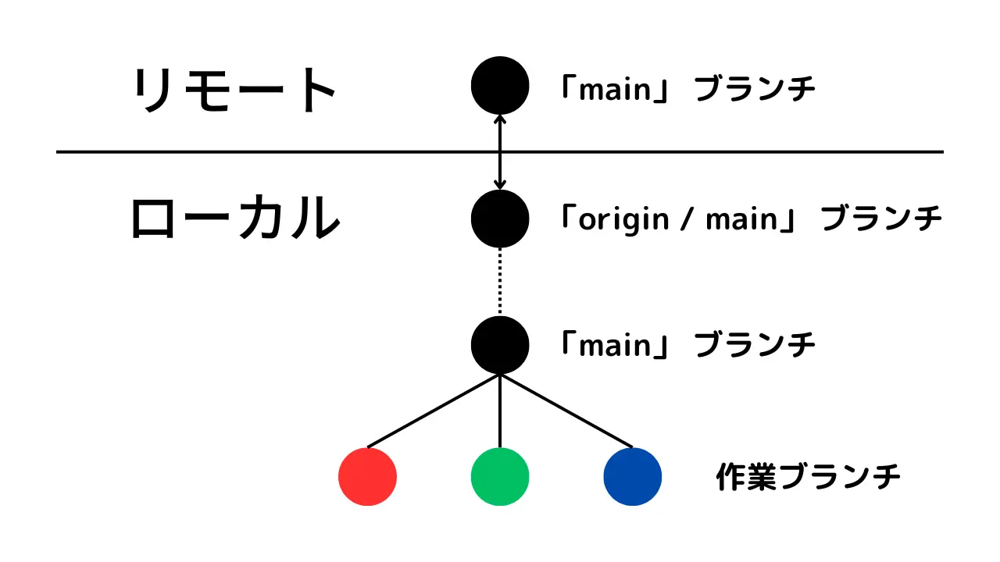

# git 使い方自分向け（超初心者）

## 最初に設定・確認すること

```sh
git config --global user.name 作業環境ごとのユーザ名
git config --global user.email 連絡のつくメールアドレス
git config --global init.defaultbranch main
git init
```

## プログラム作成中のコマンド

#### 1. ローカルにコミット

```sh
git add --all
git commit -m "コミットメッセージ　わかりやすく書く"
```

#### 2. リモートリポジトリを指定

```sh
git branch -M main
git remote add origin https://github.com/ユーザ/[作成したリポジトリ名].git
```

#### 3. リモートにプッシュ

```sh
git branch -M main
git push -u origin main
```

1, 3 を繰り返す

### ファイル選択の違い

|                       | New Files | change file | Deleted Files |  処理範囲になるファイル  |
| :-------------------- | :-------: | :---------: | :-----------: | :----------------------: |
| git add -u (--update) |     ×     |      ○      |       ○       |      リポジトリ全体      |
| git add -A (--all)    |     ○     |      ○      |       ○       |      リポジトリ全体      |
| git add .             |     ○     |      ○      |       ○       | カレントディレクトリ以下 |

## `add` の取り消し

### `git init` 直後などそのファイルの最初のコミット前の時

```sh
git rm --cached [ファイル名]
git rm --cached -r [ディレクトリ]
git rm --cached -r .
```

### 2回目以降のローカルリポジトリにファイルがあるときのコミット前

```sh
git restore --staged [ファイル名]
git restore --staged .

git reset HEAD [ファイル名]
git reset HEAD .
```

## `commit` の取り消し

-   `--soft` ： ワークディレクトリの内容はそのままでコミットだけを取り消したい場合に使用
-   `--hard` ： コミット取り消した上でワークディレクトリの内容も書き換えたい場合に使用
    -   ワークディレクトリ = 作業ファイル？
-   `HEAD^` ： 直前のコミットを意味する
-   `HEAD~{n}` ： n個前のコミットを意味する
    -   `HEAD^`や`HEAD~{n}`の代わりにコミットのハッシュ値を書いても良い
    -   git の v1.8.5 からは、「HEAD」のエイリアスとして「@」が用意されている
    -   `HEAD~`と`HEAD^`と`@^`は同じ意味。
    -   `HEAD^^^`と`HEAD~3`と`HEAD~~~`と`HEAD~{3}`と`@^^^`は同じ意味
-   ただしWindowsの場合は`git reset --soft "HEAD^"`と、`HEAD^`を`"`で囲む

```sh
git reset --soft HEAD^
```

### `commit` の打消し

作業ツリーを指定したコミット時点の状態にまで戻し、コミットを行う<br>
（コミットをなかったことにはせず、逆向きのコミットをすることで履歴を残す）

```sh
git revert コミットのハッシュ値
```

### `commit` の上書き

コミットメッセージを変更したい時よく使う。<br>
「`git rebase`失敗した時、コンフリクトを避けるためにコミットを上書きする」という使い方もよくする。

```sh
git commit --amend
```

https://qiita.com/shuntaro_tamura/items/06281261d893acf049ed

## ログを確認（ローカル？）

```sh
git log
```

## リモートからローカルに取り込む

### クローンの作成（最初のダウンロード）

＊リポジトリ名のファイルでダウンロードされるので実行場所注意

```sh
git clone https://github.com/ユーザ/[リポジトリ名].git ([ディレクトリ名])
```

### リモートの変更をローカルに移しこむ(2回目以降のダウンロード)

＊`main`で作業中の場合<br>
＊違う場合必ず↓を実行 `main` に `checkout` する

```sh
git checkout main
```

```sh
git fetch origin main
git merge origin/main

git pull origin main
```

`git pull` は `fetch` と `marge` を同時に行う（大型開発では非推奨？）


### 戻すとき

`git fetch` でエラーの場合

```sh
git reset --hard HEAD
```

`git marge` `git pull` でエラーの場合

```sh
git merge --abort
git reset --hard HEAD
```

#### 各コマンドの違い

https://qiita.com/wann/items/688bc17460a457104d7d

### その他の取り込みの場合

https://qiita.com/baby-0105/items/6481c7140e357ba04ffc

## コミットせずに変更を退避する

https://qiita.com/chihiro/items/f373873d5c2dfbd03250

## gitのアップデート

```sh
git version
git update-git-for-windows
```

# MyStats

## 自分のWEBサイト

https://mosunset.com/

## Stats Card

<p align="left">
  
  
</p>

[](https://github.com/ryo-ma/github-profile-trophy)
